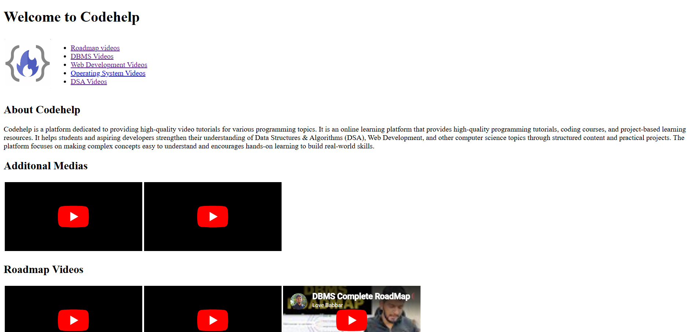

# CodeHelp Media Project

## Description
This is a beginner HTML project inspired by the CodeHelp Web Development course.

## Features
- Navigation links
- About CodeHelp section
- Embedded YouTube videos
- Organized content using HTML
- Media integration using iframes

## Technologies Used
- HTML5

## Preview

## Learning Outcomes
- Working with HTML structure
- Embedding videos using iframe
- Creating internal navigation
- Organizing content using semantic HTML

## Author
Mahak

